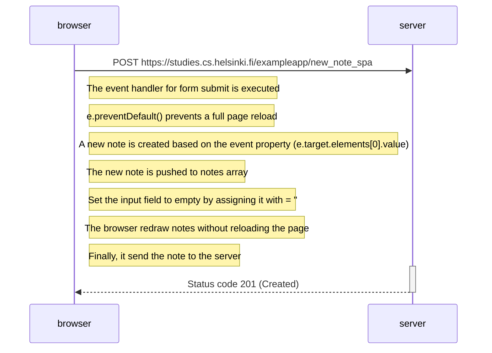

```mermaid
sequenceDiagram
    participant browser
    participant server

    browser->>server: POST https://studies.cs.helsinki.fi/exampleapp/new_note_spa
    Note right of browser: The event handler for form submit is executed
    Note right of browser: e.preventDefault() prevents a full page reload
    Note right of browser: A new note is created based on the event property (e.target.elements[0].value)
    Note right of browser: The new note is pushed to notes array
    Note right of browser: Set the input field to empty by assigning it with = ''
    Note right of browser: The browser redraw notes without reloading the page
    Note right of browser: Finally, it send the note to the server
    activate server
    server-->>browser: Status code 201 (Created)
    deactivate server
```
